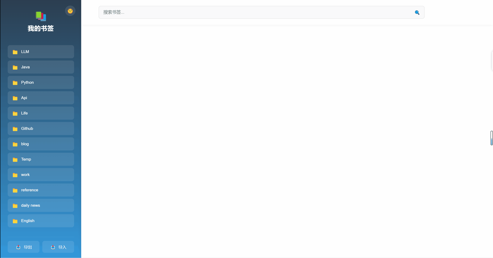

# Bookmark Plus

Chrome 书签管理扩展。

## 主要功能

### 1. 书签管理
- 📚 文件夹式管理
- 🔍 实时搜索功能
- ✏️ 书签编辑
- 🗑️ 书签删除
- 🖱️ 拖拽排序
- 📤 书签导出
- 📥 书签导入

### 2. 排序功能
- 📊 默认排序
- 🔥 访问频率排序
- 🌐 域名排序
- 📑 标题排序
- 🕒 时间排序

### 3. 界面特性
- 🌞 中英文双语支持
- 🌞/🌜 明暗主题切换
- 🚀 返回顶部
- ✨ 欢迎提示
- 💫 平滑动画效果
- 📱 响应式设计

## 使用说明

### 基本操作
1. 点击扩展图标打开管理界面
2. 左侧显示书签文件夹列表
3. 右侧显示当前文件夹的书签
4. 点击 📚 图标进入全局搜索模式
5. 点击 📤 导出书签
6. 点击 📥 导入书签

### 书签操作
- 点击 ✏️ 编辑书签
- 点击 🗑️ 删除书签
- 拖动书签可以调整顺序
- 悬停在书签上显示操作按钮

### 搜索和排序
- 使用顶部搜索框搜索书签
- 使用排序下拉菜单选择不同的排序方式
- 全局搜索模式下可搜索所有书签

### 主题和语言
- 点击左上角的 🌞/🌜 按钮切换主题
- 自动适应浏览器语言设置（支持中英文）
- 主题和语言设置会被保存

## 技术特性
- JavaScript
- Chrome Extension Manifest V3
- Chrome Storage API
- Chrome Bookmarks API
- Chrome i18n API
- 响应式布局设计
- CSS 动画和过渡效果

## 安装方法
1. 下载源代码
2. 打开 Chrome 扩展管理页面 (chrome://extensions/)
3. 开启开发者模式
4. 点击"加载已解压的扩展程序"
5. 选择项目文件夹

## 功能演示

### 搜索功能

### 排序功能

### 主体切换

### 拖拽

### 编辑删除

